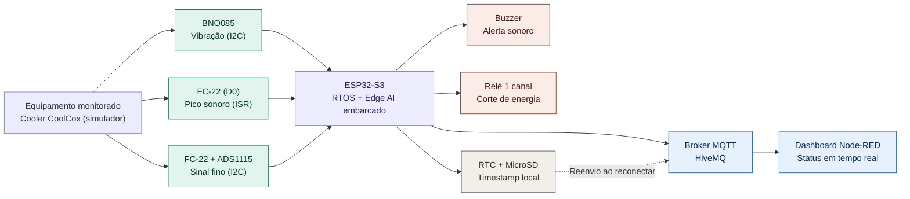

# Monitoramento Preditivo Vibroacústico com Edge AI

> Detectar a degradação de equipamentos rotativos antes da falha, direto na borda, lendo o que a vibração e o ruído já denunciam antes que um humano perceba.

Trabalho de Conclusão do Intensivo Maker (PNAAT 2026), Solução de IoT com inferência embarcada (Edge AI): monitoramento contínuo de vibração e ruído harmônico de um equipamento rotativo, classificação local normal/anômalo e resposta local + remota via MQTT.

Desenvolvido pela equipe **Wayne Enterprises:**
- André Wesley Barbosa Rodrigues Filho
- Guilherme Venâncio de Souza
- Pedro Yan Alcantara Palacios
- Levi Farias Leite

> 📋 Organizamos nosso fluxo de contribuição, padrões de commit e boas práticas do repositório em [CONTRIBUTING.md](./CONTRIBUTING.md), e o andamento das tarefas no nosso ([Project Kanban](https://github.com/users/lfariazzz/projects/5/views/1)).

---

## Sumário

1. [Visão Geral do Problema e da Solução](#1-visão-geral-do-problema-e-da-solução)
2. [Arquitetura — Diagrama de Blocos](#2-arquitetura--diagrama-de-blocos)
3. [Requisitos e Dependências](#3-requisitos-e-dependências)
4. [Pré-requisitos e Recursos Necessários](#4-pré-requisitos-e-recursos-necessários)
5. [Instalação, Configuração e Execução](#5-instalação-configuração-e-execução)
6. [Instruções de Montagem (Hardware)](#6-instruções-de-montagem-hardware)
7. [Estrutura do Repositório](#7-estrutura-do-repositório)
8. [Escopo e Limitações](#8-escopo-e-limitações)

---

## 1. Visão Geral do Problema e da Solução

**O problema:** Em manufatura pesada, equipamentos rotativos de alta exigência (motores elétricos, rolamentos de trefilas) sofrem desgaste progressivo — desbalanceamento, desalinhamento, perda de lubrificação — que altera sutilmente sua vibração e ruído harmônico semanas antes de uma falha catastrófica, de forma imperceptível aos sentidos humanos. Isso mantém a manutenção presa entre dois extremos: agir só depois da quebra (reativo) ou trocar peças por calendário sem necessidade real (preventivo cego), ambos gerando paradas não programadas e custos altos.

**A solução:** Este projeto propõe um nó de borda (ESP32-S3) que monitora continuamente a vibração e o ruído do equipamento, extrai características do sinal e classifica o padrão como normal ou anômalo com um modelo de IA embarcado, decidindo localmente e sem depender de rede. Ao detectar uma anomalia, o sistema aciona uma resposta local imediata (alerta e corte de energia via relé) e publica o evento remotamente via MQTT, mantendo registro local com timestamp mesmo offline. O escopo desta PoC — o que fica de fora e por quê — está detalhado na seção 8 (Escopo e Limitações).

---
## 2. Arquitetura — Diagrama de Blocos



> O corte de energia do relé sobre o equipamento monitorado e refinamentos futuros do dashboard (histórico gráfico, múltiplos dashboards) não são representados graficamente aqui; ficam descritos em texto para não sobrecarregar o diagrama.

---

## 3. Requisitos e Dependências

> A lista abaixo deve representar **a mesma solução** descrita no diagrama e nos requisitos — qualquer item aqui precisa aparecer também na arquitetura, e vice-versa.

### 3.1 Hardware

| Componente | Função na arquitetura | RF relacionado |
|---|---|---|
| ESP32-S3 (Heltec WiFi LoRa 32 V3) | Roda o RTOS, lê os sensores e decide se há anomalia | RF-04, RF-05 |
| BNO085 (IMU) | Captura a assinatura de vibração do equipamento monitorado | RF-01 |
| FC-22 (sensor de som) | Captura o ruído harmônico do desgaste, em duas camadas (pico via interrupção + sinal fino via ADC) | RF-02, RF-03 |
| ADS1115 | Melhora a resolução da leitura analógica do FC-22 | RF-02 |
| Cooler CoolCox (PWM) | Motor de teste sob monitoramento (simula o equipamento rotativo) | — |
| Relé 1 canal | Aciona resposta física à anomalia (corte de energia) | RF-07 |
| Buzzer | Alarme sonoro local imediato | RF-06 |
| Módulo RTC + MicroSD | Registra eventos com timestamp real | RF-09, RF-10 |


### 3.2 Software / Bibliotecas / Plataformas

| Item | Uso | Versão |
|---|---|---|
| [PREENCHER] | [PREENCHER] | [PREENCHER] |
| [PREENCHER] | [PREENCHER] | [PREENCHER] |
| [PREENCHER] | [PREENCHER] | [PREENCHER] |

---

## 4. Pré-requisitos e Recursos Necessários

> Elemento previsto na anatomia do README (pergunta estrutural "o que eu preciso ter antes de começar?"), aplicável desde esta entrega — a Entrega 6 exige que essas informações estejam completas e sem ambiguidade, não que a seção só passe a existir ali.


- [ ] [PREENCHER — hardware físico necessário]
- [ ] [PREENCHER — software instalado na máquina de desenvolvimento]
- [ ] [PREENCHER — contas/serviços externos necessários]
- [ ] [PREENCHER — conhecimento mínimo esperado, se houver]

---

## 5. Instalação, Configuração e Execução

> Os passos aqui devem corresponder exatamente às dependências listadas na Seção 3 (exigência da Entrega 4) e serem completos o suficiente para reprodução sem ambiguidade (exigência da Entrega 6).

### 5.1 Clonar o repositório
```bash
[PREENCHER]
```

### 5.2 Instalar dependências
```bash
[PREENCHER]
```

### 5.3 Configuração de rede e credenciais
```
[PREENCHER]
```

### 5.4 Como executar

> Comandos ou procedimentos exatos para rodar o projeto do zero.

```bash
[PREENCHER: comando de build]
[PREENCHER: comando de flash/upload]
[PREENCHER: comando de monitoramento, se aplicável]
```

[PREENCHER: se houver dashboard/painel externo, como acessá-lo]


### 5.5 Configuração adicional (modelo, integrações, etc.)
```
[PREENCHER]
```

---

## 6. Instruções de Montagem (Hardware)

> Exigência explícita da Entrega 6 quando há conexões elétricas. Incluir pinout completo e, se possível, imagem/diagrama do circuito montado.

### 6.1 Tabela de conexões (pinout)

| Componente | Pino do componente | Pino do controlador | Observação |
|---|---|---|---|
| [PREENCHER] | [PREENCHER] | [PREENCHER] | [PREENCHER] |
| [PREENCHER] | [PREENCHER] | [PREENCHER] | [PREENCHER] |
| [PREENCHER] | [PREENCHER] | [PREENCHER] | [PREENCHER] |

### 6.2 Diagrama elétrico / foto da montagem

[PREENCHER: inserir imagem do esquemático ou foto real da bancada montada]

### 6.3 Cuidados de montagem

- [PREENCHER]

---

## 7. Estrutura do Repositório

> Precisa corresponder exatamente aos tópicos deste README (exigência da Entrega 4, nível Avançado) — os caminhos citados abaixo devem existir de verdade no repositório.

```
/
├── README.md
├── CONTRIBUTING.md   # Diretrizes de contribuição para o repositório
├── /firmware        # [PREENCHER]
├── /hardware         # [PREENCHER]
├── /docs
│   ├── /diagramas    # [PREENCHER]
│   └── /requisitos   # [PREENCHER]
├── /scripts          # [PREENCHER]
└── /data             # [PREENCHER]
```

*[PREENCHER: ajustar conforme a estrutura real do projeto for se consolidando]*

---

## 8. Escopo e Limitações

- **LIM-01** — O sistema não realiza atuação de corte de energia ou controle direto de maquinário industrial além do acionamento simples do relé (sem integração com CLP ou sistemas de parada industrial).
- **LIM-02** — O sistema detecta mudança de padrão em relação a uma linha de base conhecida (normal/anômalo); não realiza prognóstico de prazo exato até a falha.
- **LIM-03** — *[Aguardando teste]* O sistema não garante a integridade da classificação de anomalia para rotações do equipamento acima da faixa validada em bancada, uma vez que o sensor inercial apresenta degradação conhecida de captação de vibração em rotações muito altas. A faixa de teste do projeto foi ajustada a essa limitação do componente.
- **LIM-04** — O sistema realiza classificação pontual de janelas de dados (normal/anômala) com base em um modelo treinado contra assinaturas de degradação precoce conhecidas — padrões de vibração e ruído distintos do funcionamento normal, não a falha catastrófica em si. O sistema não rastreia a evolução do padrão ao longo do tempo a partir de uma linha de base própria do equipamento monitorado, apenas reconhece anomalias já caracterizadas no treinamento. A detecção de deriva de longo prazo (semanas) está fora do escopo desta PoC por exigir dados longitudinais de degradação real, incompatíveis com o prazo de desenvolvimento disponível.
- **LIM-05** — A comunicação via MQTT nesta PoC não implementa um mecanismo de criptografia (TLS/MQTTS), operando em rede local controlada de teste. A adoção de um canal seguro de comunicação é necessária para um cenário de implantação industrial real, mas foi considerada fora do escopo desta prova de conceito.
- **LIM-06** — O mecanismo de reconciliação após reconexão não garante deduplicação no lado do consumidor (painel); em cenários de falha parcial de rede durante o reenvio, uma mensagem pode eventualmente ser recebida mais de uma vez. Tratamento de idempotência é considerado fora do escopo desta PoC.

A especificação completa de requisitos (RF, RNF e LIM) está detalhada no artefato da Entrega 1.

---