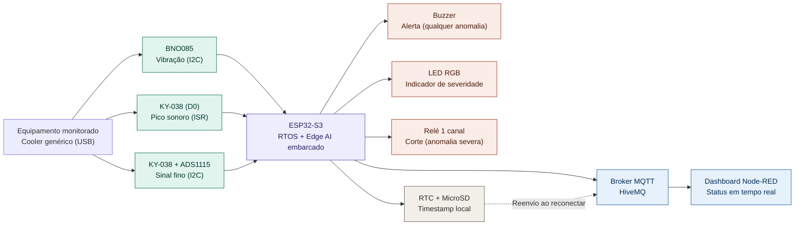

# Monitoramento Preditivo Vibroacústico com Edge AI

> Detectar a degradação de equipamentos rotativos antes da falha, direto na borda, lendo o que a vibração e o ruído já denunciam antes que um humano perceba.

Trabalho de Conclusão do Intensivo Maker (PNAAT 2026), Solução de IoT com inferência embarcada (Edge AI): monitoramento contínuo de vibração e ruído harmônico de um equipamento rotativo, classificação local em três níveis de severidade e resposta local + remota via MQTT.

Desenvolvido pela equipe **Wayne Enterprises:**
- André Wesley Barbosa Rodrigues Filho
- Guilherme Venâncio de Souza
- Pedro Yan Alcantara Palacios
- Levi Farias Leite

> 📋 Organizamos nosso fluxo de contribuição, padrões de commit e boas práticas do repositório em [CONTRIBUTING.md](./CONTRIBUTING.md), e o andamento das tarefas no nosso ([Project Kanban](https://github.com/users/lfariazzz/projects/5/views/1)).

---

## Sumário

1. [Visão Geral do Problema e da Solução](#1-visão-geral-do-problema-e-da-solução)
2. [Arquitetura — Diagrama de Blocos](#2-arquitetura--diagrama-de-blocos)
3. [Requisitos e Dependências](#3-requisitos-e-dependências)
4. [Pré-requisitos e Recursos Necessários](#4-pré-requisitos-e-recursos-necessários)
5. [Instalação, Configuração e Execução](#5-instalação-configuração-e-execução)
6. [Instruções de Montagem (Hardware)](#6-instruções-de-montagem-hardware)
7. [Estrutura do Repositório](#7-estrutura-do-repositório)
8. [Escopo e Limitações](#8-escopo-e-limitações)

---

## 1. Visão Geral do Problema e da Solução

**O problema:** Em manufatura pesada, equipamentos rotativos de alta exigência (motores elétricos, rolamentos de trefilas) sofrem desgaste progressivo — desbalanceamento, desalinhamento, perda de lubrificação — que altera sutilmente sua vibração e ruído harmônico semanas antes de uma falha catastrófica, de forma imperceptível aos sentidos humanos. Isso mantém a manutenção presa entre dois extremos: agir só depois da quebra (reativo) ou trocar peças por calendário sem necessidade real (preventivo cego), ambos gerando paradas não programadas e custos altos.

**A solução:** Este projeto propõe um nó de borda (ESP32-S3) que monitora continuamente a vibração e o ruído do equipamento, extrai características do sinal e classifica o padrão em três níveis de severidade (normal, leve, severa) com um modelo de IA embarcado, decidindo localmente e sem depender de rede. Ao detectar uma anomalia, o sistema aciona um alerta local imediato (buzzer + LED RGB indicando o nível de severidade) e, em caso de anomalia severa persistente, interrompe a energia do equipamento via relé; o evento também é publicado remotamente via MQTT, mantendo registro local com timestamp mesmo offline. O escopo desta PoC — o que fica de fora e por quê — está detalhado na seção 8 (Escopo e Limitações).

---
## 2. Arquitetura — Diagrama de Blocos



> O corte de energia do relé sobre o equipamento monitorado e refinamentos futuros do dashboard (histórico gráfico, múltiplos dashboards) não são representados graficamente aqui; ficam descritos em texto para não sobrecarregar o diagrama.

---


## 3. Requisitos e Dependências

> A lista abaixo deve representar **a mesma solução** descrita no diagrama e nos requisitos — qualquer item aqui precisa aparecer também na arquitetura, e vice-versa.

### 3.1 Hardware

| Componente | Função na arquitetura | RF relacionado |
|---|---|---|
| ESP32-S3 (Heltec WiFi LoRa 32 V3) | Roda o RTOS, lê os sensores e decide se há anomalia | RF-04, RF-05 |
| BNO085 (IMU) | Captura a assinatura de vibração do equipamento monitorado | RF-01 |
| KY-038 (sensor de som) | Captura o ruído harmônico do desgaste, em duas camadas (pico via interrupção + sinal fino via ADC) | RF-02, RF-03 |
| ADS1115 | Melhora a resolução da leitura analógica do KY-038 | RF-02 |
| Cooler genérico (USB) | Motor de teste sob monitoramento (simula o equipamento rotativo) | — |
| Relé 1 canal | Interrompe a energia em anomalia severa | RF-08 |
| LED RGB | Indica visualmente o nível de severidade (normal/leve/severa) | RF-07 |
| Buzzer | Alarme sonoro local imediato (qualquer anomalia) | RF-06 |
| Módulo RTC + MicroSD | Registra eventos com timestamp real | RF-10, RF-11 |

### 3.2 Software / Bibliotecas / Plataformas

| Item | Uso | Versão |
|---|---|---|
| ESP-IDF | Framework de desenvolvimento (FreeRTOS, drivers nativos, MQTT, Wi-Fi) | v5.5.5 |
| `rinku404/bno085` | Driver do BNO085 (protocolo SH-2), via ESP-IDF Component Manager | ^1.2.0 |
| `esp-idf-lib/ads111x` | Driver do ADS1115 em modo de conversão contínua, via ESP-IDF Component Manager | 1.1.14 |
| `esp-idf-lib/ds3231` | Driver do RTC DS3231 (módulo HW-084), via ESP-IDF Component Manager | 1.1.7 |
| `esp-idf-lib/i2cdev` | Dependência compartilhada do `ads111x` e do `ds3231` — utilitário thread-safe de acesso I2C | (resolvida automaticamente) |
| Edge Impulse SDK | Modelo de inferência exportado (classificação normal/anômalo) | — |
| `esp-mqtt` (nativo ESP-IDF) | Cliente MQTT para publicação de eventos | nativo |
| `esp_wifi` (nativo ESP-IDF) | Conectividade Wi-Fi | nativo |
| `esp_vfs_fat` + driver SD/SPI (nativo ESP-IDF) | Armazenamento local (MicroSD, FATFS) | nativo |

---
## 4. Pré-requisitos e Recursos Necessários

> Elemento previsto na anatomia do README (pergunta estrutural "o que eu preciso ter antes de começar?"), aplicável desde esta entrega — a Entrega 6 exige que essas informações estejam completas e sem ambiguidade, não que a seção só passe a existir ali.


- [ ] [PREENCHER — hardware físico necessário]
- [ ] [PREENCHER — software instalado na máquina de desenvolvimento]
- [ ] [PREENCHER — contas/serviços externos necessários]
- [ ] [PREENCHER — conhecimento mínimo esperado, se houver]

---

## 5. Instalação, Configuração e Execução

> Os passos aqui devem corresponder exatamente às dependências listadas na Seção 3 (exigência da Entrega 4) e serem completos o suficiente para reprodução sem ambiguidade (exigência da Entrega 6).

### 5.1 Clonar o repositório
```bash
[PREENCHER]
```

### 5.2 Instalar dependências
```bash
[PREENCHER]
```

### 5.3 Configuração de rede e credenciais
```
[PREENCHER]
```

### 5.4 Como executar

> Comandos ou procedimentos exatos para rodar o projeto do zero.

```bash
[PREENCHER: comando de build]
[PREENCHER: comando de flash/upload]
[PREENCHER: comando de monitoramento, se aplicável]
```

[PREENCHER: se houver dashboard/painel externo, como acessá-lo]


### 5.5 Configuração adicional (modelo, integrações, etc.)
```
[PREENCHER]
```

---

## 6. Instruções de Montagem (Hardware)

> Exigência explícita da Entrega 6 quando há conexões elétricas. Incluir pinout completo e, se possível, imagem/diagrama do circuito montado.

### 6.1 Tabela de conexões (pinout)

| Componente | Pino do componente | Pino do controlador | Observação |
|---|---|---|---|
| [PREENCHER] | [PREENCHER] | [PREENCHER] | [PREENCHER] |
| [PREENCHER] | [PREENCHER] | [PREENCHER] | [PREENCHER] |
| [PREENCHER] | [PREENCHER] | [PREENCHER] | [PREENCHER] |

### 6.2 Diagrama elétrico / foto da montagem

[PREENCHER: inserir imagem do esquemático ou foto real da bancada montada]

### 6.3 Cuidados de montagem

- [PREENCHER]

---

## 7. Estrutura do Repositório

```
/
├── README.md
├── CONTRIBUTING.md
├── .gitignore
├── LICENSE
├── firmware/
│   ├── CMakeLists.txt
│   ├── components/
│   │   ├── edge-impulse-sdk/       (gerado — gitignored)
│   │   ├── model-parameters/       (gerado — gitignored)
│   │   ├── tflite-model/           (gerado — gitignored)
│   │   ├── sensor_bno085/
│   │   ├── sensor_ky038/
│   │   ├── actuator_relay/
│   │   ├── actuator_buzzer/
│   │   ├── actuator_led_rgb/
│   │   ├── storage_datalogger/
│   │   └── connectivity_mqtt/
│   └── main/
│       ├── main.c
│       ├── task_aquisicao.c
│       ├── task_inferencia.c
│       └── task_rede.c
├── dashboard/
│   └── flow_nodered.json
└── docs/                           (artefatos entregues)
```

---

## 8. Escopo e Limitações

### Escopo (o que está incluído nesta PoC)

- Monitoramento de um único equipamento rotativo por vez, em um ponto de medição controlado (motor/rolamento simulado em bancada).
- Classificação em três níveis de severidade (normal, anomalia leve, anomalia severa) via modelo de IA embarcado, com indicação visual por LED RGB.
- Alerta sonoro local imediato para qualquer nível de anomalia; corte de energia via relé restrito a anomalia severa persistente.
- Publicação de eventos via MQTT em rede local controlada de teste, com registro local (RTC + MicroSD) e reenvio automático ao reconectar.
- Validação restrita a uma faixa de rotação e condições ambientais definidas em bancada (15°C–40°C).

### Limitações

- **LIM-01** — Sem controle de maquinário além do acionamento simples do relé (sem integração com CLP ou sistemas de parada industrial); o corte ocorre por tempo decorrido de anomalia severa, sem verificar se o equipamento está em um ponto operacional seguro para interrupção (ex: fim de um ciclo de trabalho) — fora do escopo desta PoC, que usa um motor de teste sem ciclo de trabalho discreto.
- **LIM-02** — Detecta mudança de padrão em relação a uma linha de base conhecida (normal/anomalia leve/anomalia severa); não estima prazo exato até a falha.
- **LIM-03** — Integridade da classificação garantida apenas dentro da faixa de rotação validada em bancada.
- **LIM-04** — Classificação pontual contra assinaturas de degradação já conhecidas; não rastreia a evolução do padrão do próprio equipamento ao longo do tempo (deriva de longo prazo fora do escopo).
- **LIM-05** — MQTT sem criptografia (TLS/MQTTS); opera em rede local controlada de teste.
- **LIM-06** — Sem garantia de deduplicação no consumidor em caso de falha parcial durante o reenvio após reconexão.

A especificação completa de requisitos (RF, RNF e LIM) está detalhada no artefato da Entrega 1.