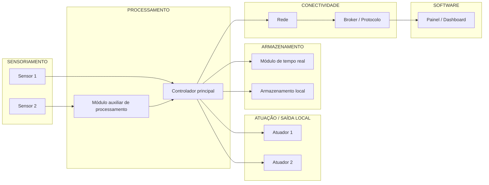

<!--
MOLDE MESTRE DO README — Wayne Enterprises / PNAAT 2026
Este arquivo já nasce estruturado para atender, ao mesmo tempo:
  - Entrega 4 (Documentação 1): sumário, diagrama de blocos preliminar, lista de dependências,
    organização de pastas correspondente aos tópicos, passos iniciais de instalação.
  - Entrega 6 (Documentação final): manual completo de replicação por terceiros — pré-requisitos,
    dependências/instalação, configuração, montagem elétrica, execução, resultado esperado.
Cada seção tem um marcador [PREENCHER] indicando o que falta. Não apague seções vazias —
elas contam como "estrutura prevista" para a Entrega 4 mesmo antes de estarem completas.
-->

# [Nome do Projeto] — Wayne Enterprises

> [PREENCHER: uma frase de efeito — o que o sistema faz e por quê, em 1 linha]

[PREENCHER: parágrafo curto de contexto — programa, módulo, e uma linha geral sobre o tipo de solução (IoT / visão computacional / integração)]

> 📋 Organizamos nosso fluxo de contribuição, padrões de commit e boas práticas do repositório em [CONTRIBUTING.md](./CONTRIBUTING.md), e o andamento das tarefas no nosso ([Project Kanban](https://github.com/users/lfariazzz/projects/5/views/1)).

---

## Sumário

1. [Visão Geral do Problema e da Solução](#1-visão-geral-do-problema-e-da-solução)
2. [Arquitetura — Diagrama de Blocos](#2-arquitetura--diagrama-de-blocos)
3. [Requisitos e Dependências](#3-requisitos-e-dependências)
4. [Pré-requisitos e Recursos Necessários](#4-pré-requisitos-e-recursos-necessários)
5. [Instalação e Configuração](#5-instalação-e-configuração)
6. [Instruções de Montagem (Hardware)](#6-instruções-de-montagem-hardware)
7. [Como Executar](#7-como-executar)
8. [Resultado Esperado / Evidência de Execução](#8-resultado-esperado--evidência-de-execução)
9. [Estrutura do Repositório](#9-estrutura-do-repositório)
10. [Escopo e Limitações](#10-escopo-e-limitações)
11. [Equipe](#11-equipe)

---

## 1. Visão Geral do Problema e da Solução

**Problema (a "dor"):** [PREENCHER — situação tratada, necessidade identificada, por que a solução atual/inexistente é insuficiente]

**Solução proposta:** [PREENCHER — resumo de 3-5 linhas de como o sistema resolve isso]

**Resultado pretendido:** [PREENCHER — o que conta como sucesso, de forma mensurável]

**Limites da solução (o que o sistema NÃO faz):** [PREENCHER]

---

## 2. Arquitetura — Diagrama de Blocos

> Diagrama preliminar. Deve representar, no mínimo: elementos de **sensoriamento**, **processamento**, **conectividade** e **software**, e a relação/fluxo entre eles (exigência da Entrega 4 para soluções de IoT). Para soluções de visão computacional, adaptar para entrada, processamento, resultado e recursos utilizados.



*[PREENCHER: substituir os rótulos genéricos pelos elementos reais da arquitetura definida]*

---

## 3. Requisitos e Dependências

> A lista abaixo deve representar **a mesma solução** descrita no diagrama e nos requisitos — qualquer item aqui precisa aparecer também na arquitetura, e vice-versa.

### 3.1 Hardware

| Componente | Função no sistema | Status |
|---|---|---|
| [PREENCHER] | [PREENCHER] | [PREENCHER] |
| [PREENCHER] | [PREENCHER] | [PREENCHER] |
| [PREENCHER] | [PREENCHER] | [PREENCHER] |

### 3.2 Software / Bibliotecas / Plataformas

| Item | Uso | Versão |
|---|---|---|
| [PREENCHER] | [PREENCHER] | [PREENCHER] |
| [PREENCHER] | [PREENCHER] | [PREENCHER] |
| [PREENCHER] | [PREENCHER] | [PREENCHER] |

---

## 4. Pré-requisitos e Recursos Necessários

> Seção exigida na Entrega 6 — tudo que uma pessoa de fora precisa **ter em mãos** antes de começar.

- [ ] [PREENCHER — hardware físico necessário]
- [ ] [PREENCHER — software instalado na máquina de desenvolvimento]
- [ ] [PREENCHER — contas/serviços externos necessários]
- [ ] [PREENCHER — conhecimento mínimo esperado, se houver]

---

## 5. Instalação e Configuração

> Os passos aqui devem corresponder exatamente às dependências listadas na Seção 3 (exigência da Entrega 4) e serem completos o suficiente para reprodução sem ambiguidade (exigência da Entrega 6).

### 5.1 Clonar o repositório
```bash
[PREENCHER]
```

### 5.2 Instalar dependências
```bash
[PREENCHER]
```

### 5.3 Configuração de rede e credenciais
```
[PREENCHER]
```

### 5.4 Configuração adicional (modelo, integrações, etc.)
```
[PREENCHER]
```

---

## 6. Instruções de Montagem (Hardware)

> Exigência explícita da Entrega 6 quando há conexões elétricas. Incluir pinout completo e, se possível, imagem/diagrama do circuito montado.

### 6.1 Tabela de conexões (pinout)

| Componente | Pino do componente | Pino do controlador | Observação |
|---|---|---|---|
| [PREENCHER] | [PREENCHER] | [PREENCHER] | [PREENCHER] |
| [PREENCHER] | [PREENCHER] | [PREENCHER] | [PREENCHER] |
| [PREENCHER] | [PREENCHER] | [PREENCHER] | [PREENCHER] |

### 6.2 Diagrama elétrico / foto da montagem

[PREENCHER: inserir imagem do esquemático ou foto real da bancada montada]

### 6.3 Cuidados de montagem

- [PREENCHER]

---

## 7. Como Executar

> Comandos ou procedimentos exatos para rodar o projeto do zero (exigência da Entrega 6).

```bash
[PREENCHER: comando de build]
[PREENCHER: comando de flash/upload]
[PREENCHER: comando de monitoramento, se aplicável]
```

[PREENCHER: se houver dashboard/painel externo, como acessá-lo]

---

## 8. Resultado Esperado / Evidência de Execução

> Exigência explícita da Entrega 6: "o resultado que permite confirmar a execução".

Ao executar corretamente, espera-se observar:

- [PREENCHER]
- [PREENCHER]
- [PREENCHER]

*[PREENCHER: incluir print de tela, trecho de log ou GIF curto quando disponível]*

---

## 9. Estrutura do Repositório

> Precisa corresponder exatamente aos tópicos deste README (exigência da Entrega 4, nível Avançado) — os caminhos citados abaixo devem existir de verdade no repositório.

```
/
├── README.md
├── CONTRIBUTING.md   # Diretrizes de contribuição para o repositório
├── /firmware        # [PREENCHER]
├── /hardware         # [PREENCHER]
├── /docs
│   ├── /diagramas    # [PREENCHER]
│   └── /requisitos   # [PREENCHER]
├── /scripts          # [PREENCHER]
└── /data             # [PREENCHER]
```

*[PREENCHER: ajustar conforme a estrutura real do projeto for se consolidando]*

---

## 10. Escopo e Limitações

**Dentro do escopo:**
- [PREENCHER]

**Fora do escopo (decisão deliberada, não limitação técnica):**
- [PREENCHER]

---

## 11. Equipe

**Wayne Enterprises**

| Nome | Papel no projeto |
|---|---|
| [PREENCHER] | [PREENCHER] |
| [PREENCHER] | [PREENCHER] |
| [PREENCHER] | [PREENCHER] |
| [PREENCHER] | [PREENCHER] |

Programa: PNAAT 2026 — Fase 2 (Intensivo Maker), Módulo de Trabalho de Conclusão da Capacitação.

---

Para diretrizes de como contribuir com este repositório, consulte o [CONTRIBUTING.md](./CONTRIBUTING.md).
