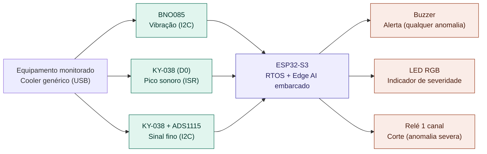
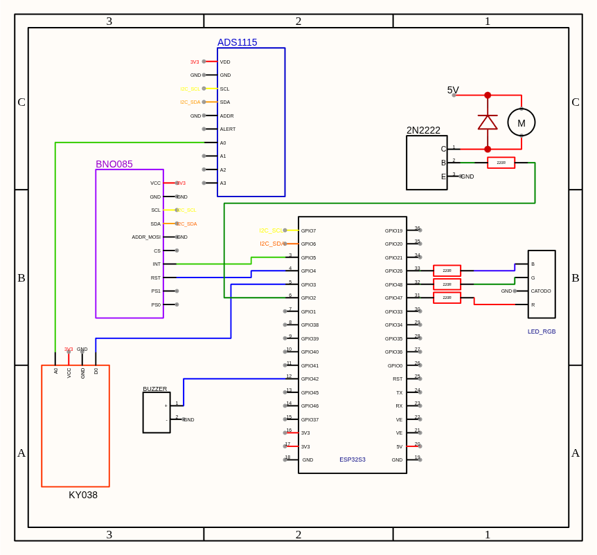

# Monitoramento Preditivo Vibroacústico com Edge AI

> Detectar a degradação de equipamentos rotativos antes da falha, direto na borda, lendo o que a vibração e o ruído denunciam o imperceptível por um humano.

Trabalho de Conclusão do Intensivo Maker (PNAAT 2026), Solução de IoT com inferência embarcada (Edge AI): monitoramento contínuo de vibração e ruído harmônico de um equipamento rotativo, classificação local em três níveis de severidade e resposta local imediata.

Desenvolvido pela equipe **Wayne Enterprises:**
- André Wesley Barbosa Rodrigues Filho
- Guilherme Venâncio de Souza
- Pedro Yan Alcantara Palacios
- Levi Farias Leite

> 📋 Organizamos nosso fluxo de contribuição, padrões de commit e boas práticas do repositório em [CONTRIBUTING.md](./CONTRIBUTING.md), e o andamento das tarefas no nosso ([Project Kanban](https://github.com/users/lfariazzz/projects/5/views/1)).

---

## Sumário

1. [Visão Geral do Problema e da Solução](#1-visão-geral-do-problema-e-da-solução)
2. [Arquitetura — Diagrama de Blocos](#2-arquitetura--diagrama-de-blocos)
3. [Requisitos e Dependências](#3-requisitos-e-dependências)
4. [Pré-requisitos e Recursos Necessários](#4-pré-requisitos-e-recursos-necessários)
5. [Instalação, Configuração e Execução](#5-instalação-configuração-e-execução)
6. [Instruções de Montagem (Hardware)](#6-instruções-de-montagem-hardware)
7. [Estrutura do Repositório](#7-estrutura-do-repositório)
8. [Escopo e Limitações](#8-escopo-e-limitações)

---

## 1. Visão Geral do Problema e da Solução

**O problema:** Em manufatura pesada, equipamentos rotativos de alta exigência (motores elétricos, rolamentos de trefilas) sofrem desgaste progressivo — desbalanceamento, desalinhamento, perda de lubrificação — que altera sutilmente sua vibração e ruído harmônico semanas antes de uma falha catastrófica, de forma imperceptível aos sentidos humanos. Isso mantém a manutenção presa entre dois extremos: agir só depois da quebra (reativo) ou trocar peças por calendário sem necessidade real (preventivo cego), ambos gerando paradas não programadas e custos altos.

**A solução:** Este projeto propõe um nó de borda (ESP32-S3) que monitora continuamente a vibração e o ruído do equipamento, extrai características do sinal e classifica o padrão em três níveis de severidade (normal, leve, severa) com um modelo de IA embarcado, decidindo localmente e sem depender de rede. Ao detectar uma anomalia, o sistema aciona um alerta local imediato (buzzer + LED RGB indicando o nível de severidade) e, em caso de anomalia severa persistente, interrompe a energia do equipamento via relé. O escopo desta PoC — o que fica de fora e por quê — está detalhado na seção 8 (Escopo e Limitações).

---
## 2. Arquitetura — Diagrama de Blocos



---


## 3. Requisitos e Dependências

### 3.1 Hardware

| Componente | Função na arquitetura | RF relacionado |
|---|---|---|
| ESP32-S3 (Heltec WiFi LoRa 32 V3) | Roda o RTOS, lê os sensores e decide se há anomalia | RF-04, RF-05 |
| BNO085 (IMU) | Captura a assinatura de vibração do equipamento monitorado | RF-01 |
| KY-038 (sensor de som) | Captura o ruído harmônico do desgaste, em duas camadas (pico via interrupção + sinal fino via ADC) | RF-02, RF-03 |
| ADS1115 | Melhora a resolução da leitura analógica do KY-038 | RF-02 |
| Cooler genérico (USB) | Motor de teste sob monitoramento (simula o equipamento rotativo) | — |
| Relé 1 canal | Interrompe a energia em anomalia severa | RF-08 |
| LED RGB | Indica visualmente o nível de severidade (normal/leve/severa) | RF-07 |
| Buzzer | Alarme sonoro local imediato (qualquer anomalia) | RF-06 |

### 3.2 Software / Bibliotecas / Plataformas

| Item | Uso | Versão | Status |
|---|---|---|---|
| ESP-IDF | Framework de desenvolvimento (FreeRTOS, drivers nativos) | v5.5.5 | ✅ |
| `rinku404/bno085` | Driver do BNO085 (protocolo SH-2), via ESP-IDF Component Manager | ^1.2.0 | ✅ |
| `esp-idf-lib/ads111x` | Driver do ADS1115 em modo de conversão contínua (sinal fino do KY-038), via ESP-IDF Component Manager | ^1.1.8 | ✅ |
| `esp-idf-lib/i2cdev` | Dependência compartilhada do `ads111x` — utilitário thread-safe de acesso I2C | ^2.1.0 | ✅ |
| Edge Impulse SDK | Modelo de inferência exportado (classificação normal/anômalo) | — | ✅ |
---
## 4. Pré-requisitos e Recursos Necessários

- [x] **Hardware físico:** placa Heltec WiFi LoRa 32 V3 (ESP32-S3) e cabo USB-C. Os demais componentes da Seção 3.1 (BNO085, KY-038, ADS1115, relé, LED RGB, buzzer, cooler) são necessários para a montagem completa da bancada; hoje o firmware já tem implementação própria para todos eles — BNO085, KY-038 (com ADS1115), LED RGB, buzzer e relé (ou transistor).
- [x] **Software na máquina de desenvolvimento:** [ESP-IDF v5.5.5](https://docs.espressif.com/projects/esp-idf/en/v5.5.5/esp32s3/get-started/index.html) instalado (inclui o toolchain `xtensa-esp32s3`), Git. Opcional: VS Code + extensão Espressif IDF.
- [x] **Contas/serviços externos:** conta no [Edge Impulse](https://edgeimpulse.com/) só é necessária caso o modelo precise ser retreinado/reexportado — o modelo já treinado vem versionado em `firmware/components/tflite-model/`, não é obrigatório recriá-lo para compilar o firmware.

---

## 5. Instalação, Configuração e Execução


### 5.1 Clonar o repositório
```bash
git clone https://github.com/lfariazzz/tcc-monitoramento_preditivo_vibroacustico.git
cd tcc-monitoramento_preditivo_vibroacustico/firmware
```

### 5.2 Instalar dependências
```bash
# Ativa o ambiente ESP-IDF na sessão atual do terminal (necessário sempre que abrir um terminal novo)
. $HOME/esp/esp-idf/export.sh      # Linux/macOS
# ou: %userprofile%\esp\esp-idf\export.bat   # Windows (cmd)

idf.py set-target esp32s3
idf.py build
```
O ESP-IDF Component Manager resolve automaticamente as dependências declaradas em `firmware/main/idf_component.yml` (`rinku404/bno085`, `esp-idf-lib/ads111x` e `esp-idf-lib/i2cdev`) a partir do `firmware/dependencies.lock`, sem passo manual adicional.


### 5.3 Como executar

> Comandos ou procedimentos exatos para rodar o projeto do zero.

```bash
idf.py build                 # compila o firmware (ver 5.2)
idf.py -p <PORTA> flash      # grava na placa (ex: -p /dev/ttyACM0)
idf.py -p <PORTA> monitor    # acompanha a saída serial em tempo real
```
> Linux: se a porta não aparecer ou der "Permission denied", adicione seu usuário ao grupo `dialout` (`sudo usermod -aG dialout $USER`, depois reabra a sessão). Windows: a porta aparece como `COMx` no Gerenciador de Dispositivos.

### 5.4 Configuração adicional

O modelo de classificação (Edge Impulse) já vem exportado e versionado em `firmware/components/tflite-model/` e `firmware/components/model-parameters/` — não é necessário reexportá-lo para compilar e rodar o firmware atual. Reexportar só é preciso se o dataset de treinamento for atualizado; nesse caso, o novo export do Edge Impulse (formato "C++ library" para ESP-IDF) deve substituir o conteúdo dessas duas pastas.

---

## 6. Instruções de Montagem (Hardware)

### 6.1 Tabela de conexões (pinout)

> Todos os componentes de hardware da Seção 3.1 já têm implementação própria no firmware (ver Seção 3.2) — a tabela abaixo cobre o pinout completo.

| Componente | Pino do componente | Pino do controlador (GPIO) | Observação |
|---|---|---|---|
| BNO085 | SDA | GPIO 6 | I2C, endereço `0x4A` — barramento compartilhado com ADS1115 |
| BNO085 | SCL | GPIO 7 | I2C, 400 kHz |
| BNO085 | INT | GPIO 5 | Pinagem provisória de bancada — ver issue #15 |
| BNO085 | RESET | GPIO 4 | Pinagem provisória de bancada — ver issue #15 |
| KY-038 | D0 (pico sonoro) | GPIO 3 | Digital, interrupção por borda de subida (ISR), com debounce de 50 ms (valor de partida por estimativa, ainda não recalibrado empiricamente em bancada — ver `sensor_ky038.c`) |
| ADS1115 | SDA | GPIO 6 | I2C, endereço `0x48` (`ADS111X_ADDR_GND`) — mesmo barramento do BNO085 |
| ADS1115 | SCL | GPIO 7 | I2C, 400 kHz — canal A0 lê o sinal fino (analógico) do KY-038 |
| Buzzer | sinal | GPIO 42 | Digital, ativo em nível alto |
| LED RGB | R | GPIO 47 | Ativo em nível alto (catodo comum) |
| LED RGB | G | GPIO 48 | Ativo em nível alto (catodo comum) |
| LED RGB | B | GPIO 26 | Ativo em nível alto (catodo comum) |
| Relé (transistor 2N2222) | Base | GPIO 2 | Chaveia o circuito de 5V do ventilador (coletor/emissor) — não o motor diretamente |

### 6.2 Diagrama elétrico / foto da montagem



### 6.3 Cuidados de montagem

- **Barramento I2C compartilhado (GPIO6/SDA, GPIO7/SCL):** BNO085 (`0x4A`) e ADS1115 (`0x48`, `ADDR` em `GND`) dividem o mesmo barramento. Endereços distintos evitam conflito, mas a ordem de inicialização no firmware importa — `sensor_ky038_init()` (que chama `i2cdev_init()` e cria o barramento) precisa rodar antes de `sensor_bno085_init()` (que só reaproveita o barramento já criado). Essa ordem já está garantida em `task_aquisicao.c`; ao montar a bancada, basta garantir que os dois dispositivos estejam de fato no mesmo par de pinos SDA/SCL.
- **Corte de energia via relé (transistor 2N2222 + GPIO2):** o transistor chaveia apenas o circuito de 5V do ventilador de teste (coletor/emissor), nunca a rede elétrica do motor diretamente. O diodo de roda-livre (flyback) em paralelo com o motor é obrigatório — protege o transistor do pico de tensão reverso gerado pela bobina do motor ao desligar. Confira a polaridade do diodo (cátodo para o 5V) antes de energizar.
- **BNO085 — INT/RESET em fiação provisória de bancada** (GPIO5/GPIO4): ainda não migrados para uma pinagem definitiva — ver issue #15. Manter os fios curtos e bem conectados nesse trecho evita reset espúrio do sensor durante a operação.
- **LED RGB — catodo comum:** a polaridade (catodo comum, nível alto acende cada cor) foi confirmada por teste físico direto na bancada, não apenas pelo datasheet do módulo — atenção ao montar um LED de lote diferente, que pode ser ânodo comum.
- **KY-038 — debounce do pino D0 (50 ms):** valor de partida por estimativa (duração típica de um evento sonoro real), ainda não recalibrado empiricamente com o hardware final — ver TODO em `sensor_ky038.c`. Se a bancada apresentar contagem de picos sensivelmente diferente do esperado, esse é o primeiro parâmetro a revisar.

---

## 7. Estrutura do Repositório

```
/
├── README.md
├── CONTRIBUTING.md
├── .gitignore
├── LICENSE
├── firmware/
│   ├── CMakeLists.txt
│   ├── dependencies.lock           (lockfile do ESP-IDF Component Manager — ver Seção 3.2)
│   ├── components/
│   │   ├── edge-impulse-sdk/       (gerado pelo Edge Impulse; versionado para build reprodutível sem reexportar)
│   │   ├── model-parameters/       (gerado pelo Edge Impulse; versionado para build reprodutível sem reexportar)
│   │   ├── tflite-model/           (gerado pelo Edge Impulse; versionado para build reprodutível sem reexportar)
│   │   ├── sensor_bno085/          (implementado)
│   │   ├── sensor_ky038/           (implementado)
│   │   ├── actuator_relay/         (implementado)
│   │   ├── actuator_buzzer/        (implementado)
│   │   └── actuator_led_rgb/       (implementado)
│   └── main/
│       ├── idf_component.yml       (declara as dependências gerenciadas — ver Seção 3.2)
│       ├── main.c                  (cria o semáforo e as tasks de aquisição/inferência)
│       ├── task_aquisicao.c        (implementada)
│       └── task_inferencia.cpp     (implementada)
└── docs/                           (artefatos entregues)
```

---

## 8. Escopo e Limitações

### Escopo (o que está incluído nesta PoC)

- Monitoramento de um único equipamento rotativo por vez, em um ponto de medição controlado (motor/rolamento simulado em bancada).
- Classificação em três níveis de severidade (normal, anomalia leve, anomalia severa) via modelo de IA embarcado, com indicação visual por LED RGB.
- Alerta sonoro local imediato para qualquer nível de anomalia; corte de energia via relé restrito a anomalia severa persistente.
- Validação restrita a uma faixa de rotação e condições ambientais definidas em bancada (15°C–40°C).

### Limitações

- **LIM-01** — Sem controle de maquinário além do acionamento simples do relé (sem integração com CLP ou sistemas de parada industrial); o corte ocorre por tempo decorrido de anomalia severa, sem verificar se o equipamento está em um ponto operacional seguro para interrupção (ex: fim de um ciclo de trabalho) — fora do escopo desta PoC, que usa um motor de teste sem ciclo de trabalho discreto.
- **LIM-02** — Detecta mudança de padrão em relação a uma linha de base conhecida (normal/anomalia leve/anomalia severa); não estima prazo exato até a falha.
- **LIM-03** — Integridade da classificação garantida apenas dentro da faixa de rotação validada em bancada.
- **LIM-04** — Classificação pontual contra assinaturas de degradação já conhecidas; não rastreia a evolução do padrão do próprio equipamento ao longo do tempo (deriva de longo prazo fora do escopo).

A especificação completa de requisitos (RF, RNF e LIM) está detalhada no artefato da Entrega 1.